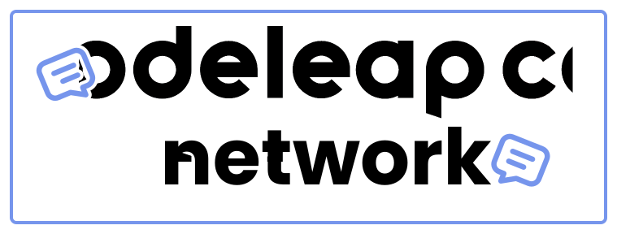
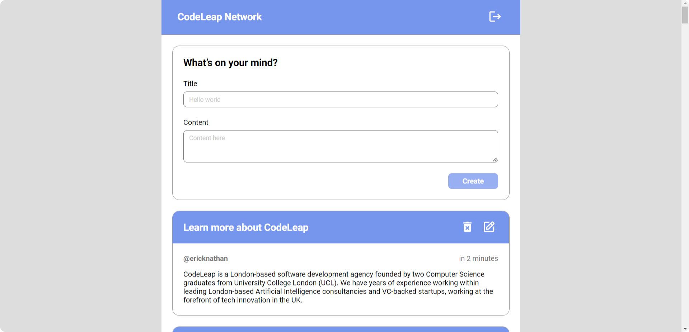

<div align="center">
   
</div>

# CodeLeap Network
CodeLeap Network is a social network application developed to manage posts on an API provided by CodeLeap. With a friendly and intuitive interface, the application allows users to view, update and delete their posts.

When opening the application, users are presented with a list of API posts, organized chronologically. They can add new posts, edit or delete existing posts.

## Avaliation key points
- In general, you should develop this as if it’s targeted for an end consumer, not for other developers. Try to impress the user within the design limitations, not just the developers.
- Your project should look exactly like these designs here, and you will not be assessed for making the designs radically customised. You can try to surprise us, but do so at your own risk!
- Consistency is key so make sure everything looks nice, neat, symmetrical and spaced correctly.
- Usability is paramount. Make sure a regular person would be able to understand and use the interface easily in different scenarios, starting points, devices or screen sizes.
- Attention to details. Please make sure you carefully look at all details in this page.
- Keep it simple. On your code, you will be assessed by how effectively you can achieve this task and reutilise your own code. We’re looking for people with are objective and results oriented.
- Deliver quickly. Although this is not the only criteria, we will judge your results based on how quickly you deliver this test once started.

## Avaliation bonus points
- [x] Make it responsive on mobile devices.
- [x] Implement some kind of permanent login logout solution.
- [x] Implement pagination or infinite scroll using the provided endpoints.
- [x] Pretty animations, transitions or hover effects. 

## Technologies used
- [Vite](https://vitejs.dev/) for the build and development of the application.
- [React](https://reactjs.org/) for build the user interface.
- [TypeScript](https://www.typescriptlang.org/) for data typing.
- [Styled Components](https://styled-components.com/) for styling components.
- [RadixUI](https://www.radix-ui.com/) for build components with accessibility.
- [Framer Motion](https://www.framer.com/motion/) for fluid animations creation.
- [Axios](https://axios-http.com/docs/intro/) communication with the API.
- [Tanstack React Query](https://tanstack.com/query/) for data caching and state management.
- [React Hook Form](https://react-hook-form.com/) for form validation.
- [Zod](https://zod.dev/) for data validation.
- [React Router](https://reactrouter.com/) for navigation between pages.
- [DayJS](https://day.js.org/) for date manipulation.

## Demo
The application is available for public access at: [thecodeleapnetwork.vercel.app](https://thecodeleapnetwork.vercel.app/)



## Running locally

### How to run the application
To run the application, you need to have [Node.js](https://nodejs.org/en/) installed on your computer. After that, just clone the repository, enter the application directory and use the following commands in your terminal:

```bash
# Installing dependencies
$ npm install

# Executing the application
$ npm run dev
```

### How to generate and run the application build locally
To generate and run the application build, just use the following command in the terminal:

```bash
# Generate the application build
$ npm run build

# Run the application build preview
$ npm run preview
```

---

😁 Project developed by [Erick Nathan](https://www.linkedin.com/in/ericknathan/).

[⬆ Back to the top](#codeleap-network)<br>